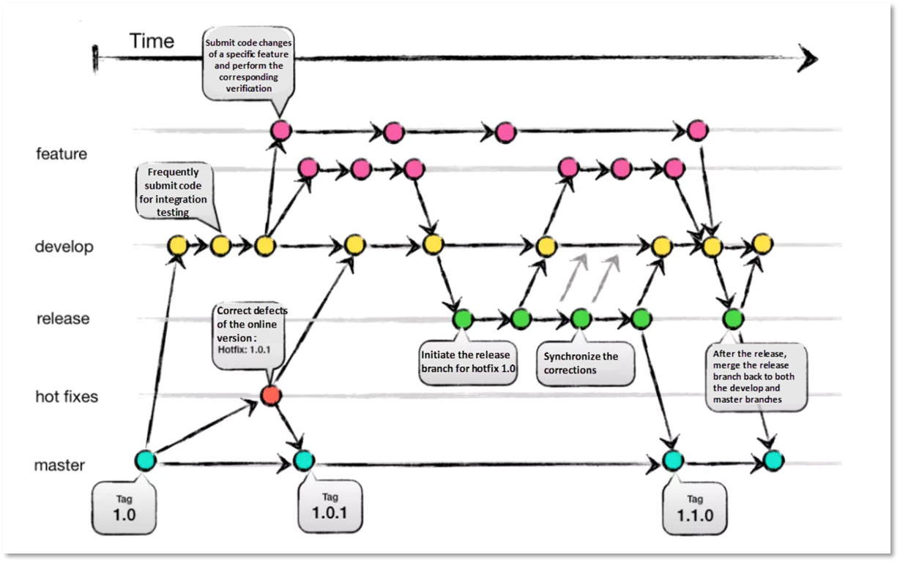

# AI 기반 개인화 도서 커뮤니티 서비스

## 목차

1. [프로젝트 개요](#1-프로젝트-개요)
   - [1.1 서비스 목표](#11-서비스-목표)
   - [1.2 기능 명세](#12-기능-명세)
2. [와이어프레임](#2-와이어프레임)
3. [기술 스택](#3-기술-스택)
4. [데이터베이스 모델링](#4-데이터-베이스-모델링erd)
5. [라우터 설계](#5-라우터-설계)
6. [api 설계](#6-api-설계)
7. [기능 설명](#7-기능-설명)
   - [7.1 기본 기능](#71-기본-기능)
   - [7.2 개인화 기능](#72개인화-기능)
   - [7.3 사용자 관련 기능](#73-사용자-관련-기능)
8. [폴더 구조](#8-폴더-구조)
9. [페어 프로그래밍](#9페어-프로그래밍)
10. [팀원 정보](#10-팀원-정보)
11. [느낀점](#11-느낀점)

## 1. 프로젝트 개요

### 1.1 서비스 목표

> AI 기반 개인화 도서 커뮤니티 서비스

### 1.2 기능 명세

| 기능                               | 상세                                               | 설명                                                                                                               | 페이지             |
| ---------------------------------- | -------------------------------------------------- | ------------------------------------------------------------------------------------------------------------------ | ------------------ |
| 1. 베스트 셀러 목록                |                                                    | - 책 선택 시 도서 상세 정보로 이동                                                                                 | 메인 페이지        |
| 2. 장르별 도서 제공 목록           |                                                    | - 장르 선택 시 도서 검색 페이지로 이동<br>- 선택한 장르 필터링 유지                                                | 메인 페이지        |
| 3. 개인 맞춤 도서 추천             | 3.1 내 서재 기반으로 추천                          |                                                                                                                    | 메인 페이지        |
|                                    | 3.2 로그인 여부에 따른 노출 문구 조건 설정         |                                                                                                                    | 메인 페이지        |
| 4. 현재 위치 기반 주변 도서관 정보 | 4.1 사용자의 현재 위치 기반 근처 도서관 표시       | - 지도 API 연동                                                                                                    | 메인 페이지        |
|                                    | 4.2 주변 도서관 목록 클릭 시 구글 맵 길찾기로 이동 |                                                                                                                    | 메인 페이지        |
| 5. 검색 기능                       | 5.1 키워드 및 연관 도서 검색                       | - ‘소년’ 검색 시 → 제목, 작가, 설명에 ‘소년’이 포함된 도서<br>- ‘해리’ 검색 시 → ‘해리엇’ 도서를 쓴 작가의 책 목록 | 도서 검색 페이지   |
|                                    | 5.2 장르 필터링 기능                               |                                                                                                                    | 도서 검색 페이지   |
| 6. 단일 도서 정보                  | 6.1 도서 설명                                      |                                                                                                                    | 도서 단일 페이지   |
|                                    | 6.2 작가 소개                                      |                                                                                                                    | 도서 단일 페이지   |
|                                    | 6.3 음성 - AI                                      | - 도서 설명 낭독                                                                                                   | 도서 단일 페이지   |
|                                    | 6.4 관련 스레드 목록                               |                                                                                                                    | 도서 단일 페이지   |
|                                    | 6.5 연관 추천 도서                                 | - 책 기반으로 같은 장르, 같은 작가의 도서 추천                                                                     | 도서 단일 페이지   |
| 7. 단일 스레드 조회                | 7.1 스레드 CRUD                                    |                                                                                                                    | 단일 스레드 페이지 |
|                                    | 7.2 좋아요                                         |                                                                                                                    | 단일 스레드 페이지 |
|                                    | 7.3 댓글 CRUD                                      |                                                                                                                    | 단일 스레드 페이지 |
|                                    | 7.4 스레드 관련 정보 연결                          | - 책 정보 → 책 상세 페이지로 이동                                                                                  | 단일 스레드 페이지 |
| 8. 마이페이지                      | 8.1 관심 카테고리 표시                             |                                                                                                                    | 마이페이지         |
|                                    | 8.2 팔로잉/팔로우                                  |                                                                                                                    | 마이페이지         |
|                                    | 8.3 작성 스레드 확인                               | - 작성 스레드 수                                                                                                   | 마이페이지         |
|                                    | 8.4 내 서재(내가 추가한 도서)                      | - ai 도서 추천 기능에 활용                                                                                         | 마이페이지         |
| 9. 회원가입                        |                                                    | - 관심 카테고리 선택 포함                                                                                          | 회원가입 페이지    |
| 10. 로그인                         |                                                    |                                                                                                                    | 로그인 페이지      |
| 11. 로그아웃                       |                                                    |                                                                                                                    |                    |
| 12. 비밀번호 수정                  |                                                    |                                                                                                                    |                    |

---

## 2. 와이어프레임

피그마 [링크](https://www.figma.com/design/Tuq2X2VYTIaKUXpkBeQmnh/%EC%B5%9C%EC%A2%85-%EA%B4%80%ED%86%B5-%EB%BF%8C%EC%8B%9C%EA%B8%B0?node-id=0-1)

## 3. 기술 스택

- 프론트엔드 : Vue3, JavaScript, Pinia
- 백엔드 : Django, DRF
- 데이터베이스 : SQLite
- 협업 툴 : notion, gitlab, figma

## 4. 데이터 베이스 모델링(ERD)


## 5. 라우터 설계

| URL pattern             | Component name     | name           |
| ----------------------- | ------------------ | -------------- |
| `/`                     | LandingView        | main           |
| `/threads`              | ThreadsListView    | threadList     |
| `/threads/:threadId`    | ThreadDetailView   | threadDetail   |
| `/:bookId/threads/form` | ThreadFormView     | threadForm     |
| `/books`                | BooksListView      | bookList       |
| `/books/:bookId`        | BookDetailView     | bookDetail     |
| `/mypage`               | MyPageView         | myPage         |
| `/login`                | LoginView          | login          |
| `/signup`               | SignUpView         | signup         |
| `/mypage/password`      | PasswordChangeView | passwordChange |

## 6. api 설계

| Endpoint                         | HTTP method | Description             |
| -------------------------------- | ----------- | ----------------------- |
| /accounts/login/                 | POST        | 로그인                  |
| /accounts/signup/                | POST        | 회원가입                |
| /books/                          | GET         | 도서 전체 목록          |
| /books/{book_id}/                | GET         | 단일 도서 정보          |
| /threads/                        | GET         | 쓰레드 전체 목록        |
| /threads/                        | POST        | 쓰레드 생성             |
| /threads/{thread_id}/            | GET         | 단일 쓰레드 정보 조회   |
| /threads/{thread_id}/            | PUT         | 단일 쓰레드 수정        |
| /threads/{thread_id}/            | DELETE      | 단일 쓰레드 삭제        |
| /threads/{thread_id}/comments/   | GET         | 댓글 목록 조회          |
| /threads/{thread_id}/comments/st | POST        | 댓글 생성               |
| /comments/{comment_id}/          | GET         | 댓글 조회               |
| /comments/{comment_id}/          | DELETE      | 댓글 삭제               |
| /comments/{comment_id}/          | PUT         | 댓글 수정               |
| /categories/                     | GET         | 카테고리 조회           |
| /threads/{thread_id}/likes/      | POST        | 쓰레드 좋아요           |
| /threads/{thread_id}/likes/      | DELETE      | 쓰레드 삭제             |
| /user/{user_id}/follow/          | POST        | 유저 팔로우/팔로우 취소 |
| /user/{user_id}/                 | GET         | 유저 정보 조회          |
| /user/me/                        | GET         | 로그인한 유저 정보 조회 |
| /my-threads/                     | GET         | 내가 작성한 스레드 정보 |
| /userbooks/                      | POST        | 내 서재에 담기          |

## 7. 기능 설명

### 7.1 기본 기능

#### 7.1.1 베스트 셀러 목록

- best_rank 필드가 존재하는 책 === 베스트 셀러인 책
- 최신순으로 7개 노출

#### 7.1.2 카테고리별 목록

- 카테고리 목록 -> 클릭 시 도서 검색 페이지로 이동
- 이동 시에는 카테고리 선택 유지

#### 7.1.3 도서 검색

- 도서 검색 시 연관 키워드도 함께 검색

#### 7.1.4 도서 상세

- 도서 상세 정보 - 작가, 출판일, 출판사
- 같은 작가의 다른 도서 추천
- 같은 카테고리 도서 추천

#### 7.1.7 스레드 목록

- 도서에 대한 생각, 이야기 작성 가능
- crud
- 스레드 좋아요

#### 7.1.6 커뮤니티 댓글 기능

- 댓글 CRUD 기능 구현
- 댓글을 작성한 사람일 경우에만 수정/삭제 버튼 표시 및 기능 동작

### 7.2개인화 기능

#### 7.2.1 내 서재 기반 도서 추천

- 내 서재 담긴 도서 기반 추천
- upstage 임베딩 AI 모델 활용
- 알라딘 API 활용
- 사용자 서재에 담긴 책 제목과 알라딘 API에서 수집한 도서 설명을 임베딩 처리하여 추천에 활용
- 로그인 하지 않은 경우, 서재에 담긴 책이 없을 경우 베스트 셀러 추천
- `getAladinBooks()` 함수는 검색에 사용할 키워드를 인자로 받음
  - 서재가 비어있을 때는 '베스트셀러', '스테디셀러' 같은 일반적인 키워드로 검색
  - 서재에 책이 있을 때는 추출한 키워드 사용

#### 7.2.2 관심 카테고리 스레드 추천

- 관심 카테고리 기반 최근 스레드 추천
- 메인 페이지 스레드 목록 노출 문구 분기 처리

  - 로그인 x -> `로그인하면 관심 장르를 바탕으로 최근 스레드를 추천해드려요`
    `
  - 로그인 o, 관심 장르 추가x -> `관심 장르를 추가하면 더 정확한 추천이 가능해요`

  - 로그인 o, 관심 장르 추가o -> `관심 장르를 바탕으로 최근 스레드를 추천해드려요`

#### 7.2.3 주변 도서관 위치 지도 기능

- 구글 map API 활용
- 주변 도서관 위치 마커 표시
- 반경 2km 내 도서관 목록 제공 -> 클릭 시 구글맵으로 이동

### 7.3 사용자 관련 기능

- 회원가입
  - 빈 필드를 입력할 경우 그에 맞는 알림창 반환
- 로그인
  - 스레드 작성, 댓글 작성은 로그인 할 경우에만 가능하도록 설정
  - 로그인 하지 않은 상태로 위와 같은 페이지에 접근할 경우 로그인 페이지로 이동
- 로그아웃
- 관심 카테고리 수정

## 8. 폴더 구조

```
final-pjt
├─ backend
│  ├─ accounts
│  ├─ api
│  ├─ app
│  ├─ books
│  └─ requirements.txt
├─ frontend
│  ├─ README.md
│  └─ src
│     ├─ App.vue
│     ├─ components
│     │  ├─ BookDetail
│     │  ├─ BookList
│     │  ├─ Landing
│     │  ├─ Layout
│     │  ├─ MyPage
│     │  ├─ ThreadDetail
│     │  ├─ ThreadForm
│     │  └─ ThreadList
│     ├─ router
│     ├─ stores
│     └─ views
├─ meeting
│  ├─ 250522.md
│  ├─ 250523.md
│  ├─ 250526.md
│  └─ 250527.md
├─ readme
└─ README.md
```

## 9.페어 프로그래밍

### 9.1 브랜치 전략 - Git Flow



### 9.2 커밋 컨벤션 - AngularJS

```
- feat (feature) : 새로운 기능 구현
- fix (bug fix) : 버그 수정
- docs (documentation) : 문서 관련 사항
- style (formatting, missing semi colons, …) : 스타일 변경 (형식, 세미콜론 누락 등 기능적 변경이 없는 경우)
- refactor : 리팩토링
- test (when adding missing tests) : 테스트, 테스트 리팩토링 한 경우
- build : 빌드 관련 파일 수정
- ci : CI 설정 파일 수정
- perf : 성능 개선
- chore (maintain) : 빌드, 패키지 관련 (업데이트 등) 혹은 그 외 자잘한 수정
```

### 9.3 이슈 트래킹

- 효율적인 작업 관리와 협업을 위해 Issues 기능 적극 활용
- **할 일(To Do)**과 **버그(Bug)**로 구분하여 관리
- 각각의 유형에 맞는 이슈 템플릿을 별도로 구성해 작성의 일관성과 명확성을 높임

## 10. 팀원 정보

#### 10.1 김예나

- 팀장
- 기능
  - 메인 페이지
  - 스레드 상세 페이지
  - 마이 페이지
  - ai 기반 도서 추천 기능
  - 로그인/회원가입 기능

#### 10.2 이진모

- 팀원
- 기능
  - 스레드 목록
  - 스레드 생성
  - 도서 목록
  - 도서 상세 페이지
  - ai 음성 생성 기능
  - 로그아웃/회원정보 수정 기능

## 11. 느낀점

#### 11.1 이진모

지금까지 관통 프로젝트를 연속적으로 진행하며 많은 성장을 이뤘다. 그중에서도 특히 두 가지를 꼽고 싶다. 첫째는 Git 관리이다. 이전에는 Git에 대해 거의 무지한 상태였지만, 프로젝트를 진행하며 브랜치, 이슈 관리 등 다양한 기능을 활용하게 되었고, 파일 버전 관리에도 익숙해질 수 있었다.

둘째는 자바스크립트의 비동기 처리에 대한 이해다. 단순히 코드를 작성하는 데 그치지 않고, 로직이 어떤 순서로 처리되는지를 실제 프로젝트를 통해 깊이 있게 이해할 수 있었다.

또한, 낯설고 사용이 꺼려졌던 AI 도구를 적극적으로 활용하면서 학습 속도를 높일 수 있었고, 최종 관통 프로젝트에서도 적절한 프롬프트 설계를 통해 원하는 기능을 구현해낼 수 있었다.

무엇보다 팀원의 중요성을 크게 느낀 경험이기도 했다. 프로젝트를 함께 진행하며 서로 어려움을 겪을 때 적극적으로 도우며 협력했고, 그 과정에서 좋은 시너지가 생겼다. 덕분에 큰 마찰 없이 프로젝트를 성공적으로 마무리할 수 있었다.

#### 11.2 김예나

기본적인 CRUD 기능을 구현하는 데에도 예상보다 많은 시간이 소요되었습니다. 특히 비동기 처리가 가장 어려운 부분 중 하나였는데, 실습 당시에는 사용이 익숙했던 Pinia 전역 상태 관리 라이브러리도 실제 프로젝트에서는 비동기 처리와 함께 사용할 때 많은 어려움을 겪었습니다. 이를 해결하기 위해 `async/await`와 `try/catch` 문법에 대해 학습하고 점점 익숙해졌습니다.

추천 기능 등 복잡한 기능을 구현할 때에는 AI 도구를 적극적으로 활용하려고 했습니다. 그러나 기대와는 달리 AI를 효과적으로 활용하기 위해서는 프롬프트를 잘 작성하는 역량이 매우 중요하다는 점을 깨달았습니다.

또한 페어 프로그래밍을 진행하며 가장 중요한 요소는 소통이라고 느꼈습니다. 평소 소통을 잘한다고 생각했지만, 실제로는 의견 충돌이나 서로의 생각 차이로 인해 조율이 필요한 순간이 많았습니다.

이번 프로젝트는 단순히 기능 구현에 그치지 않고, 처음 기획부터 마지막 배포까지 전 과정을 경험해볼 수 있었던 의미 있는 프로젝트였습니다. 실전 프로젝트를 통해 협업과 기술 양면에서 많은 성장을 할 수 있었습니다.
